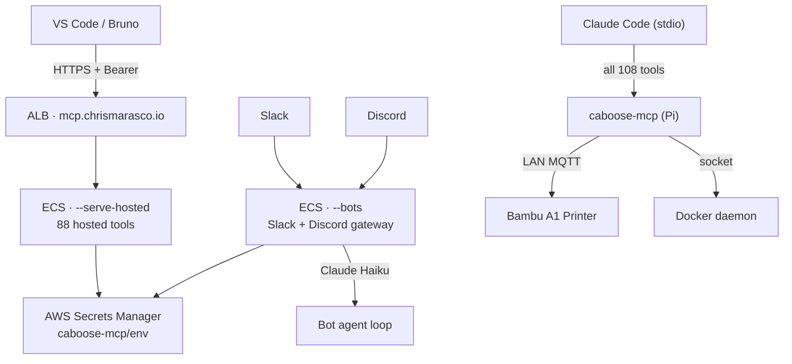

# caboose-mcp

Personal AI toolserver — 108 MCP tools exposed to Claude, VS Code, and chat bots via a Go server hosted on AWS ECS.

[](https://github.com/caboose-mcp/caboose-mcp/actions/workflows/deploy-infra.yml)
[](https://github.com/caboose-mcp/caboose-mcp/actions/workflows/deploy-bots.yml)
[](https://github.com/caboose-mcp/caboose-mcp/actions/workflows/deploy-app.yml)
[](https://github.com/caboose-mcp/caboose-mcp/actions/workflows/release.yml)
[](https://go.dev)
[](https://mcp.chrismarasco.io/ui/)
[](LICENSE)

**Live endpoint:** `https://mcp.chrismarasco.io/mcp` (bearer auth required) · **Web UI:** `https://mcp.chrismarasco.io/ui/`

---

## Architecture



---

## Tool Tiers

Tools are split so the cloud server only exposes what's safe remotely.

| Tier | Flag | Count | What's included |
|------|------|-------|-----------------|
| **Hosted** | `--serve-hosted` | 88 | Calendar, Slack, Discord, GitHub, Notes, Focus, Learning, Sources, CloudSync, Audit, Health, Secrets, DB, Mermaid, Greptile, Sandbox, Persona, Jokes, Setup |
| **Local** | `--serve-local` | 20 | Docker, execute_command, Bambu, Blender, Chezmoi, Toolsmith |
| **Combined** | `--serve` / stdio | 108 | Everything |

Full reference: [docs/tools.md](docs/tools.md)

---

## Quick Start

### Connect to the live server

**VS Code** — add to `.vscode/mcp.json`:
```json
{
  "servers": {
    "caboose-mcp": {
      "type": "http",
      "url": "https://mcp.chrismarasco.io/mcp",
      "headers": { "Authorization": "Bearer <MCP_AUTH_TOKEN>" }
    }
  }
}
```

**Bruno** — open the `bruno/` folder as a collection, set the `production` environment `authToken`.

Get the token:
```bash
aws secretsmanager get-secret-value --secret-id caboose-mcp/env \
  --query 'SecretString' --output text \
  | python3 -c "import sys,json; print(json.load(sys.stdin)['MCP_AUTH_TOKEN'])"
```

### Run locally (Claude Code on Pi)

```bash
cd packages/server && go build -o caboose-mcp .

# Interactive setup wizard — writes .env
./caboose-mcp --setup

# Terminal UI dashboard
./caboose-mcp --tui

./caboose-mcp                # stdio — all tools (Claude Code)
./caboose-mcp --serve        # HTTP :8080 — all tools
./caboose-mcp --serve-hosted # HTTP :8080 — hosted tools only
./caboose-mcp --serve-local  # HTTP :8080 — local tools only
./caboose-mcp --bots         # Slack + Discord bots (blocks)
```

`.mcp.json` for Claude Code:
```json
{
  "mcpServers": {
    "caboose": { "command": "/path/to/packages/server/caboose-mcp", "type": "stdio" }
  }
}
```

### Run with Docker Compose (server + n8n)

```bash
cp .env.example .env          # fill in secrets
docker compose -f docker/docker-compose.yml up -d
```

| Service | URL |
|---------|-----|
| MCP server | `http://localhost:8080/mcp` |
| n8n | `http://localhost:5678` |

Full setup instructions for both local and hosted deploys: [docs/setup.md](docs/setup.md)

---

## CI / CD

| Workflow | Trigger | Action |
|----------|---------|--------|
| `ci.yml` | PR / push to main | Lint, test, build (amd64+arm64), e2e, UI build + changelog generation |
| `deploy-infra.yml` | Push to `terraform/aws/**` or manual | `tofu apply` + sync secrets to AWS Secrets Manager |
| `deploy-bots.yml` | Push to `packages/server/**` on main | Build image (Node.js UI → Go) → ECR → redeploy `caboose-mcp-bots` |
| `deploy-app.yml` | Push to `packages/server/**` or `packages/ui/**` on main | Build image → ECR → redeploy `caboose-mcp-serve` → index Greptile |
| `release.yml` | Push to main or `v*.*.*` tag | Build linux/amd64 + linux/arm64 → GitHub Release (auto date-tag on merge) |

### Releases

Releases are created **automatically on every merge to main** with a date-based tag (`vYYYY.MM.DD.N`). For a versioned release, push a `v*.*.*` tag:

```bash
git tag v1.2.0
git push origin v1.2.0
```

---

## Infrastructure

AWS resources managed by OpenTofu in `terraform/aws/`:

- **ECS Fargate** — `caboose-mcp-bots` (`--bots`) + `caboose-mcp-serve` (`--serve-hosted`)
- **ALB** — HTTPS 443, HTTP→HTTPS redirect, `mcp.chrismarasco.io`
- **ACM** — TLS cert, DNS-validated via Route53
- **ECR** — Docker image registry (lifecycle: keep last 5)
- **Secrets Manager** — `caboose-mcp/env` — secrets injected into ECS tasks at startup
- **S3** — encrypted config sync bucket
- **CloudWatch Logs** — 30-day retention per service

```bash
cd terraform/aws
cp terraform.tfvars.example terraform.tfvars
tofu init && tofu plan && tofu apply
```

---

## Adding a Tool

```bash
tool_scaffold   # generate tools/mytool.go skeleton
tool_write      # write the file
tool_rebuild    # go build
```

Or edit `packages/server/tools/` directly — one `.go` file per feature group.

---

## Repository Layout

```
packages/server/         Go MCP server (108 tools)
  tools/                 One .go file per feature group
  config/config.go       All env vars → Config struct
  main.go                Flags, server builders, HTTP mux, bot runner
  ui/dist/               Embedded React UI (built by CI)
packages/ui/             React + Vite + Tailwind web UI
  src/pages/             Home, Tools, Sandbox, AuthPortal, Changelog
  src/data/tools.ts      Full tool catalog used by the UI
packages/vscode-extension/  VS Code extension
bruno/                   Bruno collection (120 requests, 24 categories)
docker/Dockerfile        Multi-stage: Node.js UI build → Go build → alpine runtime
terraform/aws/           OpenTofu — ECS, ALB, ACM, ECR, S3, Secrets Manager
.github/workflows/       ci, deploy-infra, deploy-bots, deploy-app, release
docs/
  tools.md               Full tool reference
  setup.md               Local + hosted deployment guide, JWT RBAC, AWS costs
```

---

## License

[MIT](LICENSE) — Copyright (c) 2025 [Chris Marasco](https://chris.marasco.io)

---

## Credits

Built with love, chaos, and coffee by:

| Contributor | Role |
|-------------|------|
| [Chris Marasco](https://chris.marasco.io) ([@cxm6467](https://github.com/cxm6467)) | Architect, product owner, primary developer |
| [Claude](https://claude.ai) (Anthropic) | AI pair programmer and code generation |
| [Claude Code](https://claude.ai/claude-code) | Agentic CLI — implementation, refactoring, debugging |
| [GitHub Copilot](https://github.com/features/copilot) | Inline completion and suggestions |
